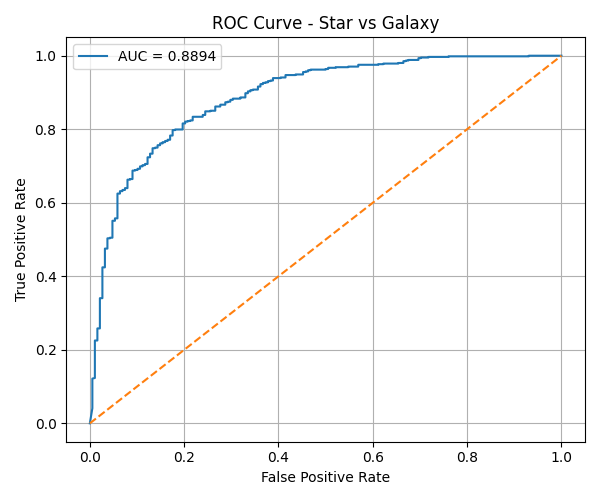

# 🌌 Star–Galaxy Image Classification

> _“From photons captured by a telescope  
> to decisions made by a neural network.”_

---

## 📡 Overview

This repository presents a **binary image classification model** designed to distinguish between **stars** and **galaxies** using grayscale astronomical images.

The project explores how machine learning can extract meaningful patterns from observational data, bridging **astrophysics** and **computational intelligence**.

The focus of this repository is **model performance and reliability**, evaluated using classical statistical metrics and the **Receiver Operating Characteristic (ROC) curve**.

---

## 🔭 Scientific Motivation

In observational astronomy, separating stars from galaxies is a fundamental preprocessing step for:

- Sky surveys  
- Object catalogs  
- Large-scale structure studies  

Manual classification is no longer feasible at scale.  
This project demonstrates how a **convolutional neural network (CNN)** can learn the subtle morphological differences between point-like stellar sources and extended galactic structures.

---

## 🧠 Model Description

- Input: **64 × 64 grayscale telescope images**
- Task: **Binary classification**
  - `0` → Star  
  - `1` → Galaxy
- Architecture: Convolutional Neural Network (CNN)
- Framework: **TensorFlow / Keras**

The model is trained end-to-end using labeled observational data.

---

## 📊 Evaluation Metrics

Model performance is evaluated using:

- Accuracy  
- Precision  
- Recall  
- F1-score  
- Confusion Matrix  
- **ROC Curve & AUC**

### ROC Curve Result

- **AUC ≈ 0.89**

This indicates strong separability between stellar and galactic image features, significantly above random classification.

> The ROC curve is used as the primary evaluation artifact included in this repository.

---

## 🧪 Key Results (Example)

| Class    | Precision | Recall | F1-score |
|--------- |---------- |--------|----------|
| Star     | 0.58      | 0.80   | 0.67     |
| Galaxy  | 0.93      | 0.82   | 0.87     |

Overall Accuracy: **~81%**
ROC Curve:


---

## 🗂️ Repository Structure
```
.
├── data/ 
│ ├── star/                 
│ └── galaxy/
├── train_model.py
├── evaluate_model.py
├── classifier_model.h5 #AI model
├── README.md

```

---

## 🚀 Why This Matters

This project demonstrates that:

- Machine learning models can capture **physically meaningful features** from raw observational data.
- Classical evaluation tools like ROC curves remain essential for scientific credibility.
- Even simple CNN architectures can provide strong baselines for astronomical image classification.

---

## 📌 Notes

- Interpretability tools (e.g., Grad-CAM) were explored during development but are not included in this repository.
- The emphasis here is on **robust evaluation**, not visual explainability.

---

## 🛰️ Closing Statement

This work stands at the intersection of **data**, **physics**, and **curiosity**.

Every pixel is a photon.  
Every prediction is a hypothesis.

And every curve on the ROC plot is a quiet conversation between the universe and mathematics.

---

